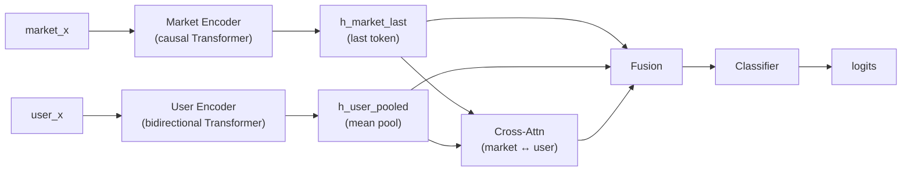

# Dual Encoder Transformer: Market-User Cross-Attention Architecture

This document describes the DualEncoderTransformer architecture for predicting trade outcomes using both market context and user trading history.

## Overview

The DualEncoderTransformer is designed to predict whether a trade will be profitable by combining two complementary sources of information:

1. **Market Sequence**: Recent trades in the same market leading up to the target trade
2. **User Sequence**: Historical trades made by the user placing the target trade

The key insight is that profitable trading decisions depend on both:
- **Market dynamics**: Price movements, liquidity, momentum, other traders' behavior
- **User patterns**: Trading skill, risk tolerance, historical performance, behavioral biases

By encoding both sequences and allowing them to interact via cross-attention, the model can discover patterns like:
- "This user tends to be early to price moves in volatile markets"
- "This market pattern often precedes a reversal, but this user has historically profited from it"

---

## Architecture Diagram



---

## Input Features

### Market Sequence Features (D_market = 12)

Each trade in the market sequence has 12 continuous features:

| Index | Feature | Description | Range/Scale |
|-------|---------|-------------|-------------|
| 0 | `price` | Trade execution price | [0, 1] |
| 1 | `p_yes` | Current YES probability | [0, 1] |
| 2 | `outcome_index` | Which outcome (0=NO, 1=YES) | {0, 1} |
| 3 | `dp_yes_clip` | Price change (clipped) | ~[-0.5, 0.5] |
| 4 | `log_dt` | Log time since last trade | log scale |
| 5 | `log_usdc_size` | Log trade size in USDC | log scale |
| 6 | `user_recent_pnl_asinh` | User's recent PnL (asinh) | asinh scale |
| 7 | `user_avg_size_log` | User's average trade size | log scale |
| 8 | `user_days_active_log` | Days user has been active | log scale |
| 9 | `user_hist_pnl_asinh` | User's historical PnL | asinh scale |
| 10 | `user_hist_winrate` | User's historical win rate | [0, 1] |
| 11 | `user_pnl_std_log` | User's PnL volatility | log scale |

### User Sequence Features (D_user = 4)

Each trade in the user's history has 4 features:

| Index | Feature | Description | Range/Scale |
|-------|---------|-------------|-------------|
| 0 | `price` | Trade execution price | [0, 1] |
| 1 | `p_yes` | Probability at trade time | [0, 1] |
| 2 | `outcome_index` | Which outcome user bet on | {0, 1} |
| 3 | `y` | Trade outcome (win/loss/unknown) | {0, 0.5, 1} |

**Note on User Y**: The outcome is masked to 0.5 for trades where the market hasn't resolved yet. This prevents information leakage during training and matches the inference scenario.

---

## Attention Patterns

### Market Encoder: Causal Attention

The market encoder uses **causal (autoregressive) attention** where each position can only attend to previous positions:

```
Position:  1  2  3  4  5
        ┌─────────────────┐
      1 │ ✓  ✗  ✗  ✗  ✗  │
      2 │ ✓  ✓  ✗  ✗  ✗  │
      3 │ ✓  ✓  ✓  ✗  ✗  │
      4 │ ✓  ✓  ✓  ✓  ✗  │
      5 │ ✓  ✓  ✓  ✓  ✓  │
        └─────────────────┘
        ✓ = can attend, ✗ = masked
```

**Rationale**: In real-time trading, you only know about trades that have already happened. The causal mask ensures the model learns patterns that can be applied causally at inference.

### User Encoder: Bidirectional Attention

The user encoder uses **full bidirectional attention** where each position can attend to all other positions:

```
Position:  1  2  3  4  5
        ┌─────────────────┐
      1 │ ✓  ✓  ✓  ✓  ✓  │
      2 │ ✓  ✓  ✓  ✓  ✓  │
      3 │ ✓  ✓  ✓  ✓  ✓  │
      4 │ ✓  ✓  ✓  ✓  ✓  │
      5 │ ✓  ✓  ✓  ✓  ✓  │
        └─────────────────┘
```

**Rationale**: User history is fully available when making a prediction. The order matters (recent trades are more relevant), but bidirectional attention allows the model to identify patterns across the entire history.

### Cross-Attention: Market ↔ User Interaction

Two cross-attention operations allow information flow between the encoders:

1. **Market → User** (Query from market, Key/Value from user):
   - Uses the last market token as query
   - Attends to all user history tokens
   - Learns: "Given this market state, which user behaviors are relevant?"

2. **User → Market** (Query from user, Key/Value from market):
   - Uses mean-pooled user representation as query
   - Attends to all market tokens
   - Learns: "Given this user profile, which market patterns matter?"

---

## Target Trade Processing

The **target trade** (the one we're predicting) is the **last token** in the market sequence:

```
Market Sequence: [trade_1, trade_2, ..., trade_{n-1}, trade_n]
                                                      ↑
                                              TARGET TRADE
```

Due to causal attention:
- The target trade's **features** (price, size, user stats) are encoded via input projection
- The target trade's **hidden state** incorporates context from all previous trades via attention
- The model predicts whether this trade will be profitable

The final hidden state of the last token (`h_market[-1]`) captures both:
1. The target trade's own characteristics
2. The full market context leading up to it

---

## Pooling Strategies

| Representation | Strategy | Rationale |
|----------------|----------|-----------|
| `h_market_last` | Last token | Target trade state with full context |
| `h_user_pooled` | Mean pooling (masked) | Aggregate user behavior pattern |
| `h_cross` | Cross-attention output | Market-user interaction |

### Mean Pooling Implementation

```python
# mask: (B, L) - True for valid tokens
mask_expanded = mask.unsqueeze(-1).float()  # (B, L, 1)
h_masked = h * mask_expanded                 # Zero out padding
h_sum = h_masked.sum(dim=1)                  # (B, d_model)
h_pooled = h_sum / mask_expanded.sum(dim=1).clamp(min=1.0)
```

---

## Model Configurations

### Small Configuration (~3M parameters)

```python
DualEncoderTransformer(
    d_market_input=12,
    d_user_input=4,
    d_model=128,
    n_market_layers=4,
    n_user_layers=2,
    n_heads=4,
    d_ff=512,
    max_market_len=1024,
    max_user_len=128,
    dropout=0.1,
)
```

### Base Configuration (~12M parameters)

```python
DualEncoderTransformer(
    d_market_input=12,
    d_user_input=4,
    d_model=256,
    n_market_layers=6,
    n_user_layers=4,
    n_heads=8,
    d_ff=1024,
    max_market_len=1024,
    max_user_len=128,
    dropout=0.1,
)
```

---

## Training

### Loss Function

Binary Cross-Entropy on trade outcome:

```python
loss = F.binary_cross_entropy_with_logits(logits, y.float())
```

Where `y ∈ {0, 1}` indicates whether the trade was profitable.

### Optimizer

AdamW with:
- Learning rate: 3e-4 (peak)
- Weight decay: 0.05
- Betas: (0.9, 0.999)

### Learning Rate Schedule

Cosine decay with linear warmup:

```python
if step < warmup_steps:
    lr = lr_max * step / warmup_steps
else:
    progress = (step - warmup_steps) / (max_steps - warmup_steps)
    lr = lr_min + 0.5 * (lr_max - lr_min) * (1 + cos(π * progress))
```

### Regularization

- Dropout: 0.1-0.15 throughout
- Gradient clipping: max norm 1.0
- Weight decay: 0.05 (AdamW)

### Mixed Precision

Training uses automatic mixed precision (AMP) with FP16 for efficiency on GPU.

---

## Metrics

### Primary Metrics

| Metric | Description |
|--------|-------------|
| `accuracy` | Classification accuracy (threshold 0.5) |
| `auc_roc` | Area under ROC curve |
| `loss` | Binary cross-entropy loss |

### Trading Metrics

For various confidence thresholds τ:

| Metric | Formula | Description |
|--------|---------|-------------|
| `take_rate_τ` | `mean(abs(p - 0.5) > τ)` | Fraction of trades with strong signal |
| `hit_rate_τ` | `mean(correct \| taken)` | Accuracy on high-confidence trades |
| `pnl_τ` | `sum(edge * sign \| taken)` | Normalized PnL on taken trades |

Where:
- `p = sigmoid(logit)` is the predicted probability
- `edge = true_outcome - price` is the realized edge
- `sign = 2 * (p > 0.5) - 1` is the trade direction

---

## Data Pipeline

### DualSequenceDataset

Returns per sample:

| Output | Shape | Type | Description |
|--------|-------|------|-------------|
| `market_x` | (L_market, D_market) | float32 | Market sequence features |
| `market_mask` | (L_market,) | bool | Valid token mask |
| `market_y` | (L_market,) | float32 | Per-token outcomes (masked) |
| `user_x` | (L_user, D_user) | float32 | User sequence features |
| `user_mask` | (L_user,) | bool | Valid token mask |
| `user_y` | (L_user,) | float32 | User trade outcomes (masked) |

### Training Label

The label for each sample is the outcome of the **last unmasked market token**:

```python
# Get index of last valid token
last_idx = market_mask.sum(dim=1) - 1  # (B,)
y = market_y[torch.arange(B), last_idx]  # (B,)
```

---

## Inference

At inference time:

1. **Input**: Market sequence + User history for target trade
2. **Forward pass**: Encode both, cross-attend, fuse, classify
3. **Output**: `p = sigmoid(logit)` - probability trade is profitable
4. **Decision**:
   - If `p > 0.5 + τ`: Strong YES signal
   - If `p < 0.5 - τ`: Strong NO signal
   - Otherwise: No action (low confidence)

### Latency Considerations

For real-time inference:
- Market encoder: ~1024 tokens × 4 layers
- User encoder: ~128 tokens × 2 layers
- Cross-attention: Single layer
- Total: <50ms on GPU

---

## File Structure

```
polyquant/
├── models/
│   ├── dual_encoder.py          # DualEncoderTransformer model
│   ├── transformer.py           # Existing transformers
│   └── __init__.py              # Exports
├── training/
│   └── train_dual_encoder.py    # Training script
└── data/
    └── datasets/
        └── dual_sequence_dataset.py  # Dataset (existing)
```

---
